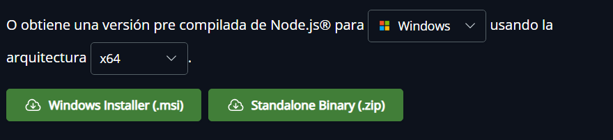
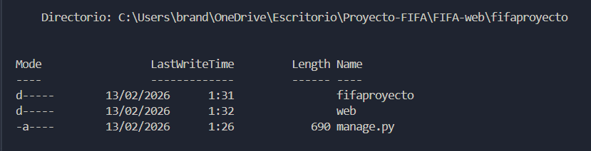
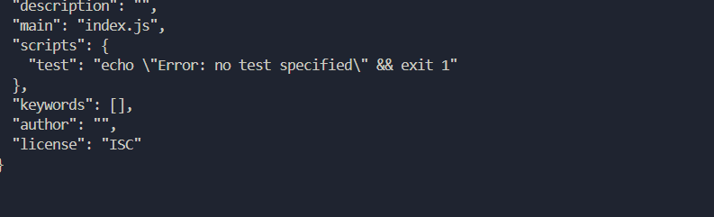
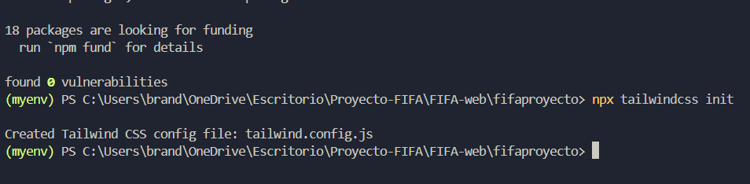
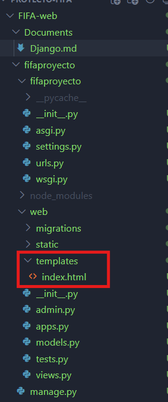

# FIFA Web - Configuración del Proyecto


## 1. Crear el Entorno Virtual

Ubicarse en la carpeta raíz del proyecto `FIFA-web` y ejecutar:

```bash
python -m venv myenv
```

Este comando crea un entorno virtual llamado `myenv`, el cual permite aislar las dependencias del proyecto.

------------------------------------------------------------

## 2. Activar el Entorno Virtual

### Windows (PowerShell)

```powershell
.\myenv\Scripts\Activate
```

### Windows (CMD)

```cmd
myenv\Scripts\activate
```

### Linux / macOS

```bash
source myenv/bin/activate
```

### En caso de bloqueo por Execution Policy (PowerShell)

Si se presenta un error relacionado con la política de ejecución, ejecutar:

```powershell
Set-ExecutionPolicy -ExecutionPolicy RemoteSigned -Scope Process
```

Luego ejecutar nuevamente:

```powershell
.\myenv\Scripts\Activate
```

------------------------------------------------------------

## 3. Instalar Django en el Entorno Virtual

Con el entorno virtual activado, ejecutar:

```bash
pip install django
```

------------------------------------------------------------

## 4. Crear el Proyecto Django

Ejecutar el siguiente comando:

```bash
django-admin startproject fifaproyecto
```

Ingresar al directorio del proyecto creado:

```bash
cd fifaproyecto
```

------------------------------------------------------------

## 5. Crear una Aplicación para la Página Web

Desde la carpeta donde se encuentra `manage.py`, ejecutar:

```bash
python manage.py startapp web
```

Registrar la aplicación en `fifaproyecto/settings.py` dentro de `INSTALLED_APPS`:

```python
INSTALLED_APPS = [
    'web',
]
```

------------------------------------------------------------

## 6. Instalación de Tailwind CSS

Tailwind CSS requiere Node.js. No se instala mediante `pip`.

Verificar que Node.js esté instalado ejecutando:

```powershell
node -v
npm -v
```

Si no se encuentra instalado, descargar la versión LTS desde:

https://nodejs.org



Después de instalar Node.js, cerrar completamente la terminal y volver a abrirla.

------------------------------------------------------------

## 7. Inicializar npm

Desde la carpeta donde se encuentra `manage.py`, ejecutar:



```bash
npm init -y
```

Este comando generará el archivo `package.json`.



------------------------------------------------------------

## 8. Instalar Tailwind CSS

Instalar Tailwind ejecutando:

```bash
npm install -D tailwindcss
npx tailwindcss init
```

Si se presenta un error al ejecutar `npx tailwindcss init`, es probable que se haya instalado la versión 4, la cual modifica la estructura interna del CLI.

Para garantizar compatibilidad con Django, utilizar Tailwind versión 3.

### 8.1 Eliminar la instalación actual

```bash
npm uninstall tailwindcss
```

### 8.2 Instalar versión estable compatible

```bash
npm install -D tailwindcss@3
```

### 8.3 Inicializar Tailwind nuevamente

```bash
npx tailwindcss init
```

Al finalizar correctamente, debe generarse el archivo:

```
tailwind.config.js
```



------------------------------------------------------------

# Configuración de Tailwind CSS en el Proyecto Django

> No seguir estos pasos si ya estan creado los archivos.

## 9. Configurar tailwind.config.js

Abrir el archivo `tailwind.config.js` y reemplazar su contenido por el siguiente:

```javascript
/** @type {import('tailwindcss').Config} */
module.exports = {
  content: [
    "./web/templates/**/*.html",
  ],
  theme: {
    extend: {},
  },
  plugins: [],
}
```

Esta configuración permite que Tailwind analice los archivos HTML ubicados dentro de la carpeta `templates` de la aplicación `web`.

------------------------------------------------------------

## 10. Crear la Carpeta static Dentro de la Aplicación

Dentro de la aplicación `web`, crear la siguiente estructura de directorios:

```
web/
│
├── static/
│   └── css/
│       ├── input.css
│       └── output.css
│
└── templates/
```

------------------------------------------------------------

## 11. Configurar el Archivo input.css

Ubicación del archivo:

```
web/static/css/input.css
```

Agregar el siguiente contenido:

```css
@tailwind base;
@tailwind components;
@tailwind utilities;
```

------------------------------------------------------------

## 12. Compilar Tailwind 

Ubicarse en la carpeta donde se encuentra el archivo `manage.py` y ejecutar:

```bash
npx tailwindcss -i ./web/static/css/input.css -o ./web/static/css/output.css --watch
```

Este comando genera el archivo `output.css` automáticamente y permanece en modo observación para actualizar los estilos cada vez que se detecten cambios.

------------------------------------------------------------

## 13. Verificar Configuración en settings.py

Abrir el archivo `settings.py` y verificar que exista la siguiente configuración:

```python
STATIC_URL = 'static/'
```

Confirmar además que la aplicación esté registrada dentro de `INSTALLED_APPS`:

```python
INSTALLED_APPS = [
    'web',
]
```

------------------------------------------------------------

## 14. Uso de Tailwind en los Templates

Crear una carpeta llamada `templates` dentro de la aplicación `web` en caso de no existir.



En el archivo `index.html`, agregar:

```html


<link href="" rel="stylesheet">
```

------------------------------------------------------------

## 15. Verificación de Funcionamiento

Agregar en cualquier template el siguiente fragmento de código:

```html
<h1 class="text-3xl text-blue-300 font-bold">
  hola
</h1>
```