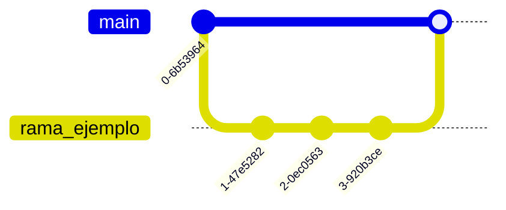

# Aprendiendo a dominar Git

Readme mejorados, son los mismos readme.md pero utilizando IA para resumir y evitar errores de texto o semantica.

## Comandos básicos de Git

### Clonar un repositorio existente

```bash
# Clona un repositorio remoto en tu máquina local
git clone <url_del_repositorio>

# Ingresa a la carpeta del proyecto
cd <nombre_del_repositorio>
```

---

### Crear un nuevo repositorio desde cero

```bash
# Inicializa un nuevo repositorio Git
git init
```

---

### Configurar usuario (solo una vez por equipo)

```bash
# Configura tu nombre
git config --global user.name "Tu Nombre"

# Configura tu correo electrónico
git config --global user.email "tu@email.com"
```

---

### Flujo básico de trabajo

```bash
# Verifica el estado del repositorio
git status

# Agrega un archivo específico
git add <archivo>

# Agrega todos los archivos modificados
git add .

# Crear un commit
git commit -m "Descripción clara del cambio"

# Enviar cambios al repositorio remoto
git push origin main
```

---

## Ramas

En esta sección se explica el uso de ramas en Git.  
Posteriormente se abordará cómo fusionarlas (merge) y sincronizar cambios.

### ¿Por qué crear una nueva rama?

Una rama permite separar el trabajo en desarrollo del proyecto principal (`main`).

Esto ayuda a:

- No afectar la versión estable del proyecto.
- Desarrollar nuevas funcionalidades de forma aislada.
- Probar cambios sin comprometer el código principal.
- Resolver conflictos antes de integrar cambios.

Si todo funciona correctamente, la rama puede fusionarse con `main`.  
Si presenta problemas, puede modificarse o eliminarse sin afectar el proyecto principal.

---

### Creación de una rama

```bash
# Ver ramas locales
git branch

# Ver ramas locales y remotas
git branch -a

# Crear una nueva rama
git branch <nombre_rama>

# Crear y cambiar automáticamente a la nueva rama
git checkout -b <nombre_rama>


```

---

### Cambiar entre ramas

```bash
# Ver ramas disponibles
git branch

# Cambiar a una rama existente
git checkout <nombre_rama>
```

---

### Eliminar una rama

```bash
# Eliminar una rama local (si ya fue fusionada)
git branch -d <nombre_rama>

# Forzar eliminación (si no fue fusionada)
git branch -D <nombre_rama>
```

---

### Convención de nombres (Buenas prácticas)

- feature/ → Nueva funcionalidad  
- bugfix/ → Corrección de errores  
- hotfix/ → Error crítico en producción  
- refactor/ → Mejora interna  
- docs/ → Documentación  
- test/ → Pruebas  
- chore/ → Tareas técnicas menores  

---

## Sincronizar cambios

### Fusionar una rama con otra (Merge)

El objetivo es unir los cambios de una rama secundaria con la rama principal (`main`).

Esto se realiza cuando una funcionalidad ha sido finalizada y probada.



Pasos del proceso:

1. Se crea una nueva rama.
2. Se realizan commits en ella.
3. Se vuelve a la rama principal (`main`).
4. Se realiza el merge.

---

### Flujo completo recomendado

```bash
# Ver estado actual
git status

# Ver ramas disponibles
git branch

# Crear y cambiar a la nueva rama
git checkout -b rama_ejemplo

# Realizar cambios
git add .

# Crear commit
git commit -m "feat: agregar nueva funcionalidad"

# Subir la rama al repositorio remoto
git push -u origin rama_ejemplo
```

---

## Crear un Pull Request (PR)

Después de hacer push, debes crear un Pull Request en GitHub.

Pasos:

1. Ir al repositorio.
2. Hacer clic en "Compare & pull request".
3. Escribir una descripción clara de los cambios realizados.
4. Seleccionar la rama base (`main` o `develop`).
5. Confirmar el Pull Request.

---

## Finalizar el proceso después del Merge

Una vez que el Pull Request ha sido aprobado y fusionado:

```bash
# Volver a la rama principal
git checkout main

# Actualizar la rama principal
git pull origin main

# Eliminar la rama local
git branch -d rama_ejemplo

# Eliminar la rama remota (opcional pero recomendado)
git push origin --delete rama_ejemplo
```

## ¿Por qué se elimina una rama luego de hacer merge?

Cuando haces esto:

Cuando fusionamos dos ramas o la rama creada con la rama main esto significa que la rama ya cumplió su función. Por lo que si la dejamos 

- Se acumulan ramas innecesarias

- El repositorio se vuelve desordenado

- Es más difícil saber qué está activo y qué no

Por eso se elimina.

## ¿Es bueno reutilizar una rama varias veces?

- No es buena práctica reutilizar la misma rama para tareas distintas en distintos momentos.

**NO es recomendable:**

- Mantener la misma rama viva durante meses

- Hacer múltiples cambios diferentes en ella

- Mezclar tareas distintas en una sola rama

¿Por qué no reutilizar la misma rama activa?

### Si sigues usando la misma rama sin cerrarla:

- El historial se mezcla

- Los PR se vuelven confusos

- Aumentan conflictos

- Es difícil revertir cambios específicos

- Pierdes trazabilidad