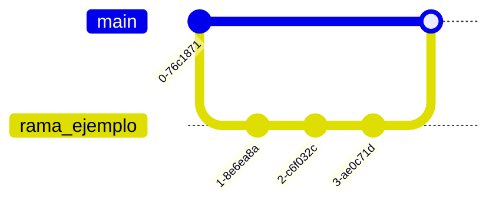

# Aprendiendo a dominar git 

**Autor:** Brandon Casas

## Comandos basicos de git 

```bash
# ==========================================
# CLONAR UN REPOSITORIO EXISTENTE
# ==========================================

# Clona un repositorio remoto en tu máquina local
git clone <url_del_repositorio>

# Ingresa a la carpeta del proyecto
cd <nombre_del_repositorio>

# ==========================================
# CREAR UN NUEVO REPOSITORIO DESDE CERO
# ==========================================

# Inicializa un nuevo repositorio Git en el proyecto actual
git init

# ==========================================
# CONFIGURAR USUARIO (solo una vez por equipo)
# ==========================================

# Configura tu nombre de usuario
git config --global user.name "Tu Nombre"

# Configura tu correo electrónico
git config --global user.email "tu@email.com"


# ==========================================
# FLUJO BÁSICO DE TRABAJO
# ==========================================

# Verifica el estado del repositorio
git status

# Agrega un archivo específico al staging
git add <archivo>

# Agrega todos los archivos modificados
git add .

# Crea un commit con un mensaje descriptivo
git commit -m "Descripción clara del cambio"

# Envía los cambios al repositorio remoto
git push origin main
```
---

## Ramas  

- Contendio referido solamente a ramas, a continuacion de esta seccion, se hablara de uniones o entre otras cosas. 

¿Por qué una nueva rama?

Buscamos separar nuestro trabajo realizado al del proyecto, con el fin de evitar mezclar y romper el proyecto de conflictos.

Si la rama se fusiona con el proyecto, todo bien, pero si si hay conflictos podemos eliminar la rama o modificar los archivos que contiene la rama para evitar errores. 

Existen diferentes formas y beneficios de las ramas que se aprenden con la experiencia.


### Creación de rama

```bash

# Verifica las ramas disponibles o si se ha creado la rama. (Ramas disponibles en tu proyecto local).

git branch

# Verifica todas las ramas disponibles en el repositorio de manera remota (all).

git branch -a # -a = all

# Crea tu primera rama

git branch <nombre_rama>

# Nombres de ramas.

# Para las buenas practicas, utilizaremos estos prefijos y sus nombres.
# Siempre en minúsculas y separando con guiones:

| Prefijo     | Cuándo usarlo                            | Ejemplo                         |
| ----------- | ---------------------------------------- | ------------------------------- |
| `feature/`  | Nueva funcionalidad                      | `feature/carrito-compras`       |
| `bugfix/`   | Corrección de errores                    | `bugfix/error-login`            |
| `hotfix/`   | Error crítico en producción              | `hotfix/pago-duplicado`         |
| `refactor/` | Mejora interna sin cambiar funcionalidad | `refactor/validaciones-modelo`  |
| `docs/`     | Documentación                            | `docs/readme-api`               |
| `test/`     | Agregar o mejorar tests                  | `test/modelos-usuario`          |
| `chore/`    | Tareas técnicas menores                  | `chore/actualizar-dependencias` |
```
### Eliminar una rama 

```bash 
git branch -d <nombre_rama> # d = delete
```

### Moverte de una rama a otra


```bash
# Visualizamos las ramas disponibles en el repositorio local.

git branch
```
#### **Selecciónar una rama**

```bash
# Selecciónamos la rama que queremos entrar

git checkout <Nombre de la rama creada>

# Version Creación y posicionamiento (Una combinación de branch y checkout)

# Con este codigo puedes hacer dos trabajos a la vez, Creas una rama y entras directamente en ella.

# Este codigo te puede ayudar a entender un punto diferente de las cosas. Entender que existen similitudes y veriedades.

git checkout -b <nombre_rama_>
```
## SINCRONIZAR CAMBIOS

### Fusionar una rama con otra (Merge)

El objetivo de esta sección es unir los cambios de una rama secundaria (rama_ejemplo) con la rama principal (main).

Esto se hace normalmente después de desarrollar una nueva funcionalidad.




1. Se crea una nueva rama.

2. Se realizan varios commits en ella.

3. Luego se vuelve a main.

4. Finalmente se hace el merge. (unir ramas)


```bash 

# Verificamos el estado del proyecto

git status 

# Ver  ramas disponibles

git branch # ramas locales
git branch -a # ramas remotas


# Crear y entrar a la rama nueva

git checkout -b rama_ejemplo

# Verificamos que la rama se haya creado

git branch

# Hacemos git status para verificar que archivos modificamos

git status

#  Agregar cambios

git add . # opcion 1: Agregar todos los cambios 

git add readme.md # Agregar solo un archivo o carpeta

# realizar un commit

git commit -m "subir estos archivos al repositorio de brandon"

# realizar push (empujo)

# -u vincula tu rama creada localmente a la rama remota

git push -u origin rama_ejemplo


# Luego nos vamos al siguiente paso:

```
### Crear un Pull Request (PR)

- Luego de hacer push para subir tu rama deberas confirmar los cambios y hacer merge de las ramas


1. Vas al repositorio del github

2. Clic en Compare & pull request

3. Explicas qué hiciste

4. Seleccionas hacia qué rama quieres hacer merge (normalmente main o develop)


